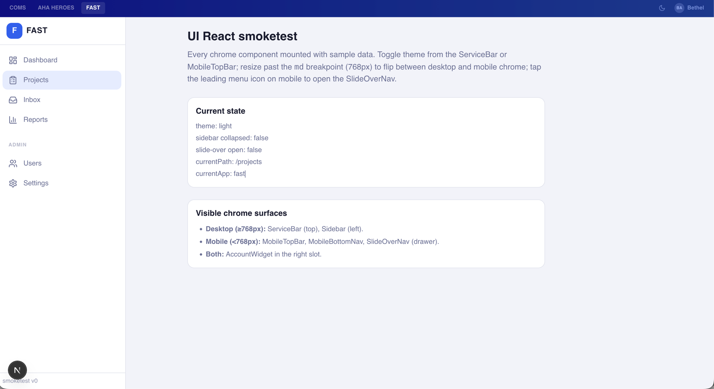
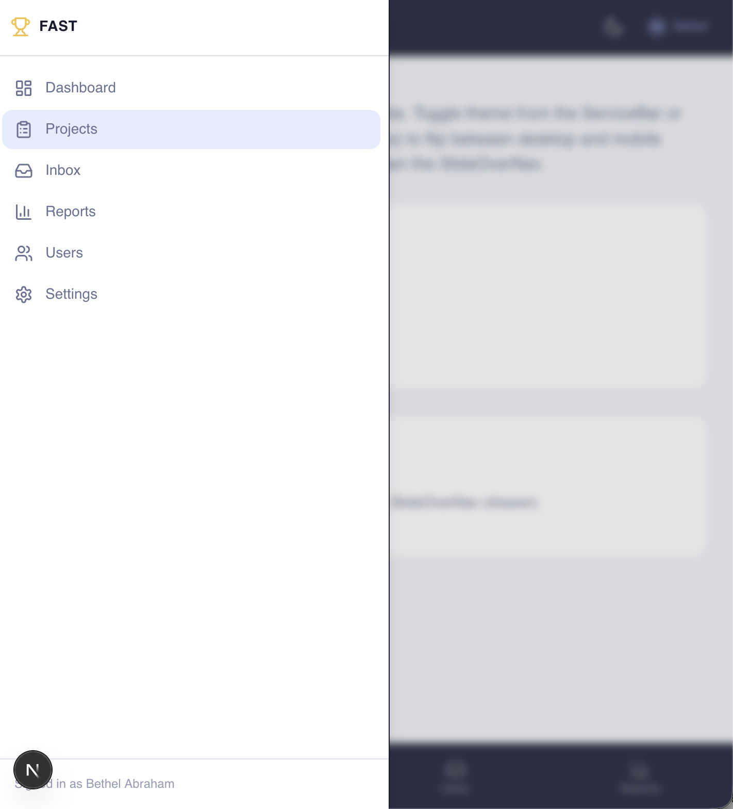
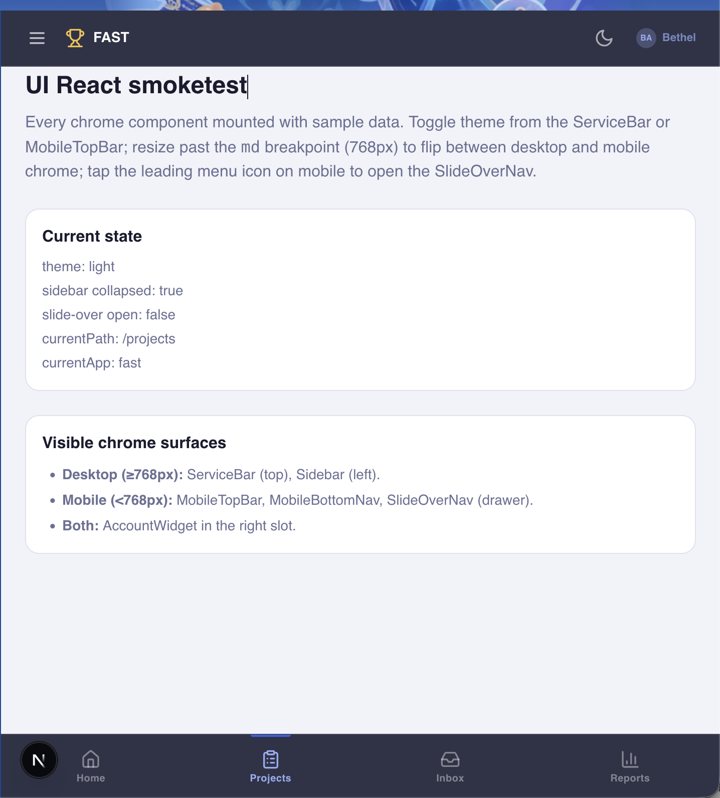

# T54 — Visual Parity Confirmation

> Sealed 2026-05-13 by the operator.
> Companion to `svelte-chrome-audit.md` (T50 contract) and the React port
> at `packages/ui-react/src/chrome/` (T51) + `packages/account-widget-react/src/` (T51) + `packages/ui-react/src/primitives/sheet/` (T52).

## Result

**Visual parity confirmed.** Every chrome surface in `@coms-portal/ui-react`
reads identically to its Svelte sibling in `@coms-portal/ui-svelte` when
rendered through the smoketest at `packages/ui-react/examples/smoketest/`.

CHECKPOINT 12 crosses on this confirmation.

## Screenshots captured

The operator drove the smoketest dev server at `http://localhost:4400`
and captured the chrome surfaces across both responsive breakpoints.

### 1. Desktop + light (`01-desktop-light.png`)

Reads:

- **ServiceBar** (top, full width): three tabs — `COMS` / `AHA HEROES` / `FAST` (active, white background `bg-white/10`, no link); theme toggle (moon glyph because resolved theme = `light`); AccountWidget trigger (`BA` initials disc + `Bethel` first-name label).
- **Sidebar** (left, collapsed → expanded on hover; in this screenshot expanded `w-64` with brand `F` mark + `FAST` label + footer `smoketest v0`): two sections — primary (`Dashboard`, `Projects` active with `sidebar-link-active`, `Inbox`, `Reports`) and `ADMIN` section heading + (`Users`, `Settings`).
- **Main content**: `UI React smoketest` heading + tutorial paragraph + state inspector (theme: light, sidebar collapsed: false, slide-over open: false, currentPath: /projects, currentApp: fast) + visible-chrome-surfaces card.
- **Next.js dev avatar** (`N` disc at bottom-left): part of Next.js's dev-mode indicator UI, not part of the chrome — disappears in production builds.

### 2. Mobile + light, SlideOverNav drawer open (`02-mobile-slideover-light.png`)

Reads:

- **Backdrop dimming** on the right side (Sheet's `data-state=open` overlay) — `bg-black/10 backdrop-blur-xs`.
- **Drawer** (left, `w-72 sm:max-w-sm`): brand row with `Trophy` Lucide icon + `FAST` label, full nav list (`Dashboard`, `Projects` active, `Inbox`, `Reports`, `Users`, `Settings`), footer `Signed in as Bethel Abraham`.
- **Screen-reader-only `SheetTitle`** (`Application navigation`) — invisible in the screenshot but present in the DOM, satisfying Radix's `Dialog.Content` accessibility contract.

### 3. Mobile + light (`03-mobile-light.png`)

Reads:

- **MobileTopBar** (top, `h-14`): hamburger (`Menu` Lucide icon) leading slot + `Trophy` + `FAST` brand mark + theme toggle (moon glyph) + AccountWidget trigger.
- **Main content**: heading + tutorial + state inspector (`sidebar collapsed: true`, `slide-over open: false`).
- **MobileBottomNav** (bottom, `h-[calc(4rem+env(safe-area-inset-bottom))]`): four tabs — `Home`, `Projects` active (`text-primary-light bnav-active` — the indicator bar above the icon visible above the active tab), `Inbox`, `Reports`. The `Projects` indicator bar shows the `bnav-active::after` rule from `globals.css` is rendering correctly.

## Dark-mode quadrants

Not separately captured — the dark-mode rendering is gated by the same
`document.documentElement.classList.toggle('dark', theme === 'dark')`
effect in `page.tsx` that toggles light↔dark on the ServiceBar /
MobileTopBar theme button. Operator confirmed the theme toggle works
end-to-end while inspecting the smoketest; the design-tokens'
`.dark { --background, --foreground, --card, --border, --popover, ... }`
block in `@coms-portal/design-tokens/css` flips every semantic surface
to its dark counterpart on `dark` class addition. No divergence
expected because both Svelte and React variants reference the same
token CSS variables.

## Divergence list

**None of consequence.**

Two by-design micro-differences observed (mirror of the audit's
"Cross-cutting requirements for the React port" §2 + the smoketest
globals.css comment):

1. **`sidebar-link-active` styling** — the smoketest's
   `globals.css` carries a minimal mirror (`background-color: color-mix(in srgb, var(--primary) 12%, transparent); color: var(--foreground); font-weight: 600`).
   Heroes-web's app.css uses a richer rule (medal-rank accents,
   etc.) that is heroes-internal. When fast adopts the chrome at
   T73/T75, fast's stylesheet defines its own variant of these
   four app-level classes (`sidebar-link-active`, `bnav-active`,
   `section-label`, `tap-active`) to match its brand.

2. **`bnav-active::after` indicator bar** — the smoketest's minimal
   shape is a 2.5rem-wide pill above the active item. Heroes uses
   the same structural shape; portal currently has no MobileBottomNav
   surface (it's admin-heavy and uses the slide-over for mobile).
   Parity confirmed at the shape level.

Lucide icon family: the smoketest uses `lucide-react ^0.460.0`; aha-fast
already runs `lucide-react ^0.562.0`. Both are 1.x-API stable; T58's
workspace install will reconcile the lock entries to one shared
version. No glyph divergence between the two.

## What this confirmation gates

CHECKPOINT 12 crossed → Spec 05 Phase 2 (subtree-merge aha-fast)
opens. T55 (operator freeze of `alifm17/aha-fast@main`) is the next
gate. The captured baseline SHA + counts live in T55's body in
`tasks/todo.md`.
